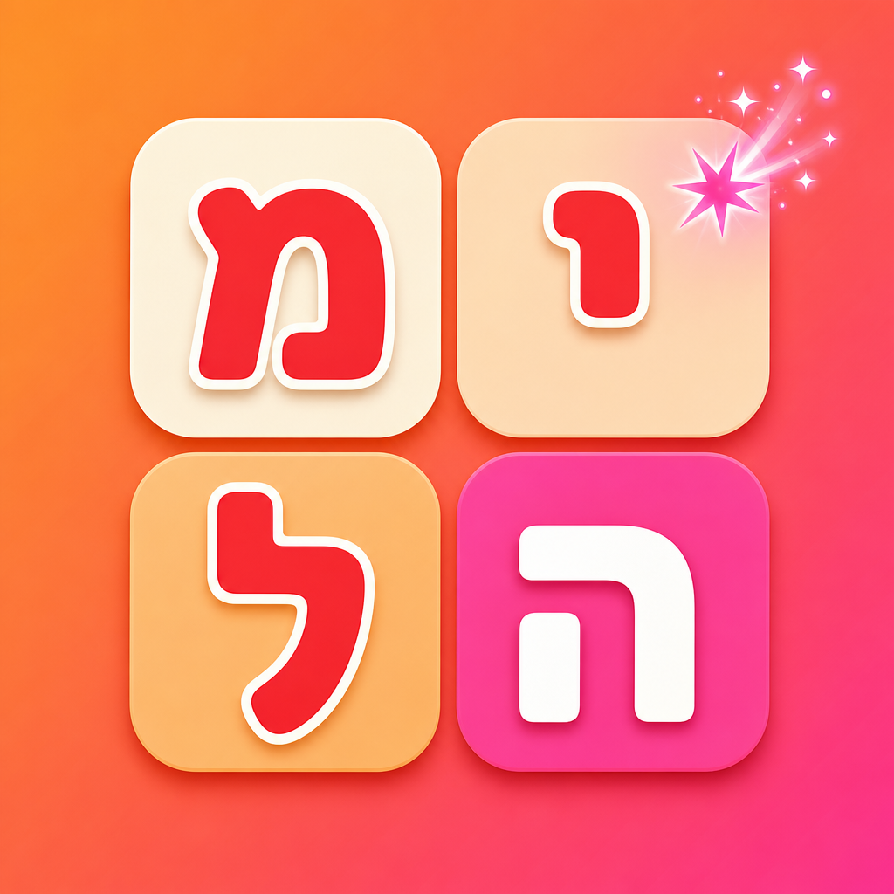
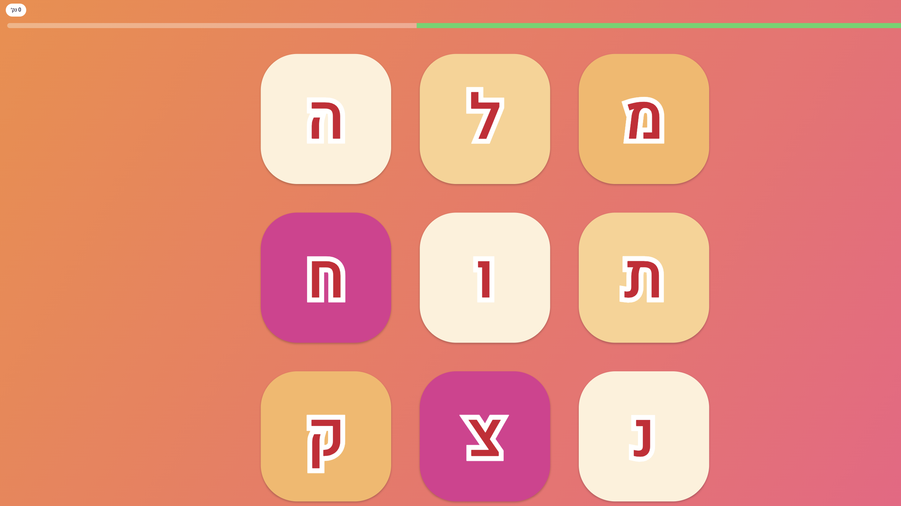
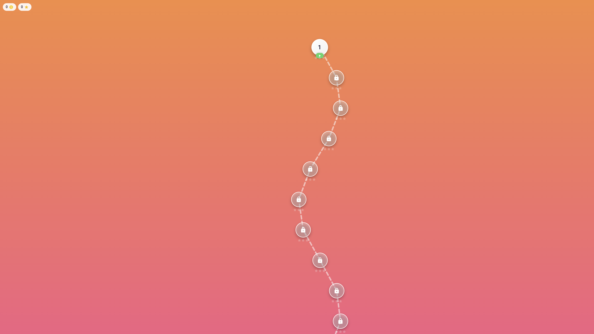

# מצא ת׳מילה 🇮🇱🔤

**משחקה של ליאן רודן.**

משחק מילים בעברית בסגנון Boggle/Wordbox: מחברים אותיות שכנות (אופקי,
אנכי או באלכסון) על לוח שגדל משלב לשלב, אוספים כוכבים ומטבעות, ומתקדמים
דרך "עולמות" צבעוניים עד ללוח 7×7 מאתגר. נבנה עם **Flutter** מקוד אחד
יחיד עבור **iPhone, Android ואתר ציבורי (Web)** - חוויה זהה בכל פלטפורמה.

<p align="center">
  
</p>

<p align="center">
  
  
</p>

> תוכנית העבודה המלאה (ניתוח המשחק, מסמך העיצוב, ארכיטקטורה) נמצאת ב-
> [`docs/GAME_DESIGN.md`](docs/GAME_DESIGN.md).

## ✨ עיקרי הפיצ'רים

- 🎯 **קמפיין יחיד-שחקן** - עשרות שלבים בחמישה "עולמות" צבעוניים, לוח
  שגדל בהדרגה מ-3×3 ועד 7×7, ויצירת לוחות "פתירים" אוטומטית מתוך מילון
  עברי מאוצר.
- 🀄 **אריחי אותיות בסגנון קנדי** - עיצוב ריבועים מעוגלים צבעוניים
  (השראה מהאייקון) עם אות אדומה עבה ומתאר לבן, ומשוב ויזואלי ברור לכל
  מצב (נבחר/הצלחה/שגיאה).
- 🔤 **מנגנון אותיות סופיות חכם** - הלוח מציג תמיד אות רגילה (כ/מ/נ/פ/צ),
  והמערכת ממירה אוטומטית לצורה הסופית (ך/ם/ן/ף/ץ) במילה שנמצאה - בלי
  בלבול חזותי על הלוח, עם דיוק דקדוקי מלא בתוצאה.
- 👥 **רב-משתתפים מקומי** - מרוץ תחרותי נגד בוטים (2-4 שחקנים), עם טבלת
  ניקוד חיה וקושי בוט מתכוונן.
- 💡 **מערכת רמזים** - 5 רמזי מתנה בהתחלה, בונוס יומי מצטבר (1 עד 7
  רמזים בכל יום כניסה, מתאפס אחרי שבוע), וחנות לקניית רמזים נוספים
  במטבעות שנצברו.
- 🐾 **זואי הבלשית** - מסקוט/מדריכה בסגנון פוינטרית גרמנית חומה, מלווה
  את השחקן/ית בהדרכה, בחוקי המשחק ובמסכי ההצלחה.
- 🎓 **הדרכה אינטראקטיבית** - מסך "איך משחקים" עם הדגמות ויזואליות
  אנימטיביות, ומסך "חוקי המשחק" עם כרטיסי הסבר ודוגמאות חיות.
- 🔐 **התחברות/הרשמה** - Google, Facebook, Apple, מייל+סיסמה, או משתמש
  אורח - עם עריכת פרופיל (כינוי + תמונה).
- 🌐 **RTL מלא + נגישות** - כל הממשק בעברית מימין-לשמאל, גופן Heebo.

## 🕹️ הרצה מקומית

```bash
flutter pub get
flutter run -d chrome      # אתר (הכי מהיר לפיתוח/בדיקה)
flutter run -d macos       # macOS desktop
flutter run                # מכשיר/אמולטור iOS או Android מחובר
```

## 🧪 בדיקות

```bash
flutter test
flutter analyze
```

## 📁 מבנה הפרויקט

```
lib/
  core/            # theme, routing, config, קבועים
  game_engine/     # לוגיקה טהורה (ללא Flutter): מילון, יצירת לוח, ניקוד
  data/            # מודלים + repositories (מקומי / Firebase)
  features/        # מסכי האפליקציה, לפי פיצ'ר
  providers/       # Riverpod providers גלובליים
assets/
  dictionaries/    # מילון עברי מאוצר (JSON)
  config/          # תדירויות אותיות ליצירת לוחות
  icon/            # אייקון האפליקציה (מקור ל-flutter_launcher_icons)
  mascot/          # תמונות המסקוט/זואי הבלשית
tool/
  seed_words_raw.txt  # מקור רשימת המילים הגולמית (ראו docs/DICTIONARY_LICENSING.md)
docs/              # מסמכי תכנון, הקמת Firebase, רישוי, השקה, צילומי מסך
```

## 🚧 מצב נוכחי

- ✅ **משחק יחיד-שחקן מלא**: קמפיין עם עשרות שלבים, לוח שגדל מ-3×3 עד 7×7,
  יצירת לוחות "פתירים" אוטומטית, ניקוד, 3 כוכבים לשלב, שמירת התקדמות
  מקומית (עובד לגמרי אופליין).
- ✅ **עיצוב ואנימציות**: מפת שלבים, מעברים, קונפטי, מסקוט מאויר, משוב
  חזותי (קו מחבר, רטט, צלילי הצלחה/כישלון), אייקון אפליקציה ייעודי לכל
  פלטפורמה.
- ✅ **רב-משתתפים מקומי**: מרוץ תחרותי מלא נגד בוטים, עובד ללא צורך
  בשרת.
- 🧪 **Backend (Firebase)**: קוד מוכן ומוכן להפעלה (Auth, Firestore
  לסנכרון התקדמות) - כבוי כברירת מחדל עד להגדרת פרויקט אמיתי. ראו
  [`docs/FIREBASE_SETUP.md`](docs/FIREBASE_SETUP.md).
- 🧪 **רב-משתתפים אונליין**: מודלים + repository מבוססי Firestore קיימים
  כשלד להמשך פיתוח.
- ✅ **מילון**: כ-15,059 מילים (שמות עצם + רבים + נטיות שייכות, פעלים
  בכל הבניינים/הזמנים, תארים עם הטיות, מילות יחס עם סיומות, סלנג) -
  נשאב מהמאגר הפתוח והחופשי
  [`hebrew-words-db`](https://github.com/roni5604/hebrew-words-db)
  (רישיון CC0, ללא עלות/ייחוס). פי ~17.2 מהמילון הקודם, וממשיך לגדול. ראו
  [`docs/DICTIONARY_LICENSING.md`](docs/DICTIONARY_LICENSING.md).

## 🔤 רישיון גופנים

הטקסטים משתמשים בגופן [Heebo](https://fonts.google.com/specimen/Heebo)
(רישיון OFL) דרך חבילת `google_fonts`.

---

<p align="center">משחקה של <b>ליאן רודן</b> 💛</p>
